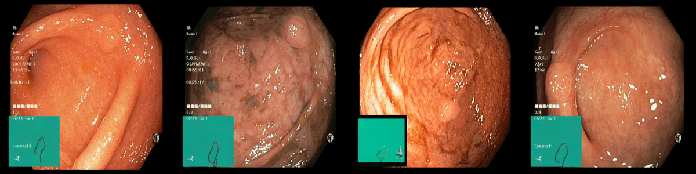
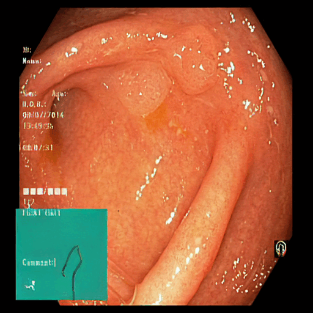
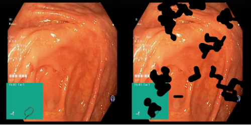
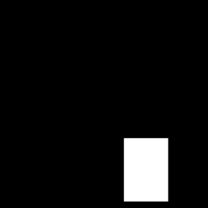

# latent-diffusion-inpainting

This repository is based on [CompVis/latent-diffusion](https://github.com/CompVis/latent-diffusion), with modifications for classifier conditioning and architecture improvements.

Since the original codebase is very big, complex and lack of documentation to fine-tune the original autoencoder and diffusion model.

It is extremely diffcult to fine tune existing pre trained model to produce good result.


#### Iusses in the original repository

[How to finetune inpainting? #151](https://github.com/CompVis/latent-diffusion/issues/151)

[how to train Inpainting model using our own datasets? #280](https://github.com/CompVis/latent-diffusion/issues/280)

[Details about training inpainting model #9](https://github.com/CompVis/latent-diffusion/issues/9)

[how to train inpainting model with my own datasets #265](https://github.com/CompVis/latent-diffusion/issues/265)

[Training inpainting model on new datasets #298](https://github.com/CompVis/latent-diffusion/issues/298)

[Reproduction problem while training inpainting model #159](https://github.com/CompVis/latent-diffusion/issues/159)


#### Hardware requirement
Without pretraining, it would take 8 V100 GPUs to produce satisfactory result. 

With finetuning, 1 3090 is enough for transfer learning to medical images( in my case )

This repository provide made the fine tuning setup and inference easy by fixing some of the bug in the original repo.

#### Major Changes

1. Load and Fine tune autoencoder (Very important for transfer learning )
2. Load and fine tune latent diffusion model
3. Combine trained autoencoder with latent diffusion model
4. Inference example for both model
5. Simplified data and mask loading 
6. Fixed some bug when training inpainting model


#### Result
Original Image


One polyp



Two polyp



## Requirements
If you already have the ldm environment, please skip it

A suitable [conda](https://conda.io/) environment named `ldm` can be created
and activated with:

```

conda env create -f ldm/environment.yaml
conda activate ldm
```
## Data Loader
From my experiment for medical images, it is better to produce a square mask instead of using polygon mask. 

If you want to change it, feel free to modify the /ldm/ldm/data/PIL_data.py to change the data loading format. 

All the dataloader used in training are in that .py file and it has simplified.

## Usage
For most of the normal image, you dont need to finetune the autoencoder.

You will want to funetune the autoencoder when your data is very different from the pretrained dataset, for exmaple endoscopic images. 

So, you can skip part 1 and 2.

#### 1. Finetune the autoencoder
Since the autoencoder used for the pre-trained inpainting is vq-f4-noattn, we have to stick with it.

First, prepare the images and masks with the same format as in kvasir-seg folder  (we DO NOT need any mask to finetune autoencoder)

Second, modify the data path in config.yaml( it should be in ldm/models/first_stage_models/vq-f4-noattn/config.yaml)

Then, run the following command
```
CUDA_VISIBLE_DEVICES=0 python main.py --base ldm/models/first_stage_models/vq-f4-noattn/config.yaml --resume ldm/models/first_stage_models/vq-f4-noattn/model.ckpt --stage 0 -t --gpus 0,

```
The model is trained with 50% of the original image and 50% of randomly masked image




#### 2. Comebine the autoencoder with the diffusion model
Please refer to the combine.ipynb
#### 3. Finetune Latent diffusion model

Note that, the mask in here is in square mask, you can disable draw_rectangle_over_mask function in the /ldm/ldm/data/PIL_data.py to use original mask.




First, prepare the images with the same format as in kvasir-seg folder

Second, modify the data path in config.yaml( it should be in ldm/models/ldm/inpainting_big/config.yaml )

Then, run the following command
```
CUDA_VISIBLE_DEVICES=0 python main.py --base ldm/models/ldm/inpainting_big/config.yaml --resume /ldm/models/ldm/inpainting_big/last.ckpt --stage 1 -t --gpus 0,

```

#### 4. Load and Inference
Please refer to those inference notebook.
